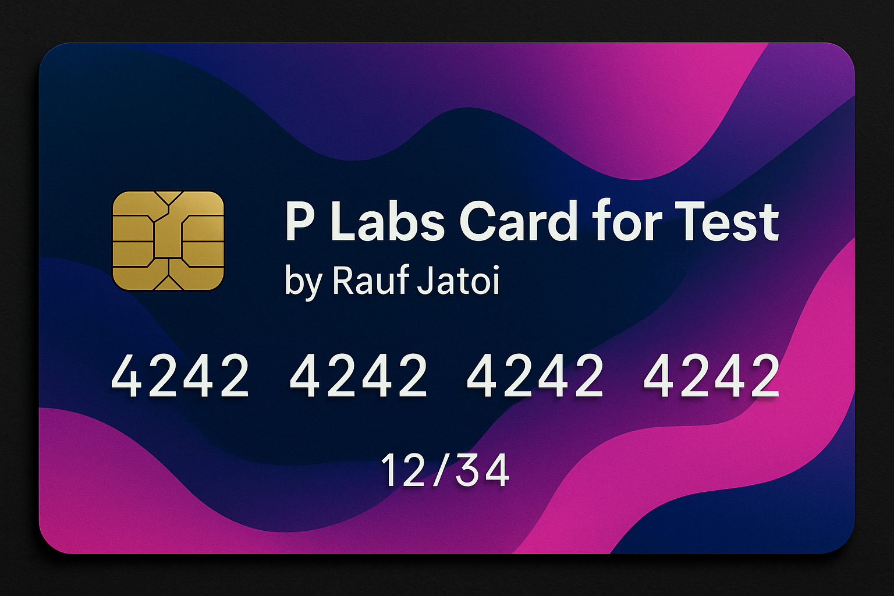

# **P Labs – Generate ML Models by Describing Your Ideas**

**Turn your imagination into AI-powered reality.**  
With **P Labs**, you can bring your machine learning ideas to life simply by describing them. Our intuitive platform transforms your concepts into functional Python ML models—and even builds interactive web apps for you.

## **Website Screenshot**  
  

---

## **Core Features**

- **🚀 ML Model Generation** – Just describe your machine learning idea, and P Labs will generate ready-to-use Python code.  
- **🌐 Interactive Web Apps** – Instantly convert your models into **Streamlit** web applications *(Pro feature)*.  
- **💳 Flexible Pricing Plans** – Choose from **Free**, **Basic**, or **Pro** tiers with different limits for AI generations, dataset uploads, and support.  
- **👨‍💻 Team Collaboration** – Work together with your team on projects in real time *(Future plan)*.  
- **🔌 API Access** – Integrate P Labs features directly into your workflows via our API *(Future plan)*.  

---

## **Technologies Used**

| Technology  | Logo |
|-------------|------|
| Supabase    |  |
| React       |  |
| Vite        |  |
| Tailwind CSS|  |
| Shadcn      |  |
| Stripe      |  |
| Deno        |  |
| TypeScript  |  |  

---

## **SaaS Features & Payments**

P Labs uses **Stripe** for secure payment processing.  
Currently, payments are in **test mode**, so you can try the checkout flow without real charges.

### **Testing Payments in Stripe**

Use the following test card details for demo purposes:  

- **Card Number:** `4242 4242 4242 4242`  
- **Expiry Date:** Any future date (e.g., `12/34`)  
- **CVC:** Any 3 digits (e.g., `123`)  

## **P Labs Test Card by Rauf Jatoi** 

  

## **Website**
(https://p-labs.vercel.app/)[https://p-labs.vercel.app/]